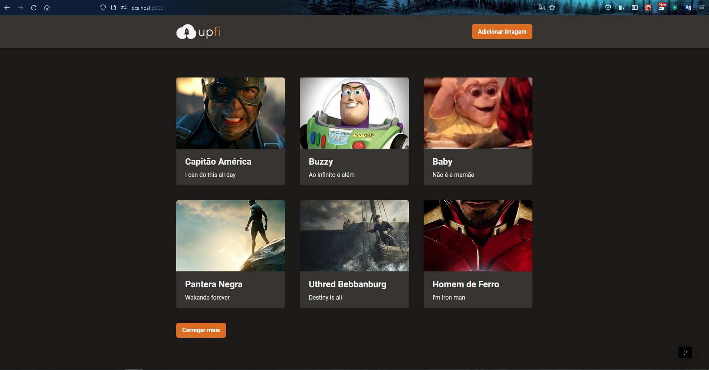
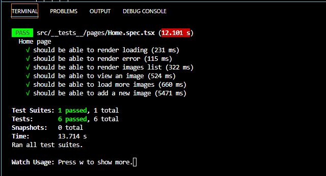

<h1 align="center">Ignite: Desafio 07 - Upload de imagens</h1>

## :bookmark_tabs: Desafio
O principal objeto desta aplicação é adicionar alguns trechos de códigos para que o upload de imagens funcione corretamente. Ela deve realizar requisições para sua própria API Next.js que vai retornar os dados do [FaunaDB](https://fauna.com/) (banco de dados) e do [ImgBB](https://pt-br.imgbb.com/) (serviço de hospedagem de imagens).

> 3 pontos abordados no desafio:

  - [React Query](https://react-query.tanstack.com/)
  - [React Hook Form](https://react-hook-form.com/)
  - [Chakra UI](https://chakra-ui.com/)

## :sparkler: Aplicação

https://user-images.githubusercontent.com/34512572/169923040-3ca234e6-79dd-4f93-a41e-5ed5e1bd63e2.mp4

## :white_check_mark: Testes

